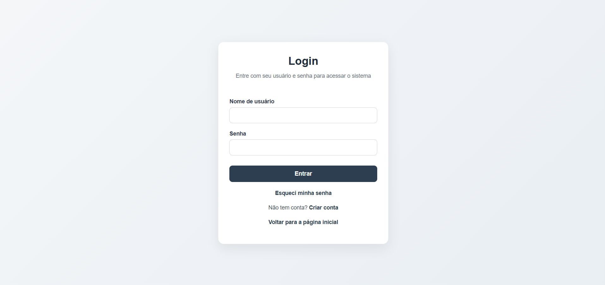
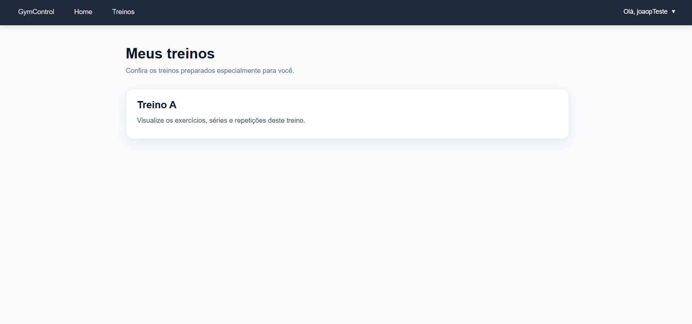
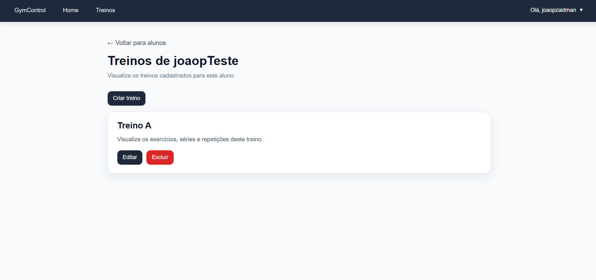

# GymControl — Frontend

Frontend desenvolvido para o Trabalho 2 da disciplina INF1407.

## Autor

* João Pedro Zaidman dos Santos Gonçalves - 2329464

## Links

* Frontend publicado: [\[LINK DO FRONTEND\]](https://inf-1407-trab2-front.vercel.app/)
* Repositório do backend: [\[LINK DO REPOSITÓRIO DO BACKEND\]](https://github.com/jpxzn/INF1407-Trab2-Back)
* Backend publicado: [\[LINK DO BACKEND\]](https://inf-1407-trab2-back.vercel.app/)
* Swagger: [\[LINK DO BACKEND\]](https://inf-1407-trab2-back.vercel.app/swagger/)

## Descrição

O GymControl é um sistema Web para visualização e gerenciamento de treinos de academia.

O frontend se comunica com uma API REST desenvolvida separadamente em Django. A aplicação possui diferentes páginas e ações para alunos e administradores.

### Visão do aluno

O aluno pode:

* cadastrar sua conta;
* realizar login;
* consultar e atualizar seu perfil;
* visualizar apenas os próprios treinos;
* consultar exercícios, séries e repetições;
* alterar a própria senha;
* solicitar recuperação de senha.

### Visão do administrador

O administrador pode:

* visualizar os alunos cadastrados;
* consultar os treinos de cada aluno;
* criar treinos;
* editar treinos;
* excluir treinos;
* adicionar exercícios aos treinos;
* editar séries e repetições;
* remover exercícios dos treinos.

## Tecnologias utilizadas

* HTML
* CSS
* TypeScript
* JavaScript gerado pelo compilador TypeScript
* Fetch API
* Local Storage
* JWT
* Vercel

Todo código JavaScript escrito durante o desenvolvimento foi produzido em TypeScript e depois compilado para JavaScript.

## Estrutura do projeto

```text
INF1407-Trab2-Front/
├── public/
│   ├── css/
│   ├── javascript/
│   ├── index.html
│   ├── login.html
│   ├── cadastro.html
│   ├── perfil.html
│   ├── treinos.html
│   ├── treino.html
│   ├── esqueci-senha.html
│   └── redefinir-senha.html
├── typescript/
├── docs/
│   └── images/
├── tsconfig.json
└── README.md
```

## Imagens

### Tela de login



### Área do aluno



### Área administrativa



## Instalação local

### 1. Clonar o repositório

```bash
git clone https://github.com/jpxzn/INF1407-Trab2-Back
cd INF1407-Trab2-Front
```

### 2. Instalar o TypeScript

Com instalação local:

```powershell
npm install
```

Ou, caso o TypeScript esteja instalado globalmente:

```powershell
npm install -g typescript
```

### 3. Configurar o endereço do backend

Abra:

```text
typescript/constantes.ts
```

Para utilizar o backend publicado:

```typescript
export const backendAddress =
    "https://[ENDEREÇO-DO-BACKEND]/";
```

Para utilizar o backend local:

```typescript
export const backendAddress =
    "http://127.0.0.1:8000/";
```

### 4. Compilar o TypeScript

```powershell
npx tsc
```

Ou:

```powershell
tsc
```

Os arquivos JavaScript serão gerados em:

```text
public/javascript/
```

Não edite manualmente os arquivos dessa pasta. As alterações devem ser realizadas nos arquivos `.ts`.

### 5. Executar o frontend

Na raiz do projeto:

```powershell
python -m http.server 8080 --directory public
```

Depois acesse:

```text
http://127.0.0.1:8080/
```

## Manual do usuário

### Criar uma conta

1. Acesse a página inicial.
2. Clique em `Criar conta`.
3. Informe nome de usuário, e-mail e senha.
4. Confirme o cadastro.
5. Vá para a página de login.

### Realizar login

1. Abra a página de login.
2. Informe o nome de usuário.
3. Informe a senha.
4. Clique em `Entrar`.

Após o login, o sistema identifica se o usuário é aluno ou administrador.

### Utilização como aluno

1. Realize login com uma conta de aluno.
2. Acesse a página de treinos.
3. O sistema mostrará somente os treinos associados ao aluno autenticado.
4. Clique em um treino para visualizar seus exercícios.
5. Consulte a quantidade de séries e repetições.

O aluno não possui permissão para criar, editar ou excluir treinos.

### 🔑 Acesso como Admin

Para acessar como administrador:
- Vá até a página de login
- Utilize:
  - **Usuário:** admin  
  - **Senha:** admin123  

### Utilização como administrador

1. Realize login com uma conta administrativa.
2. Acesse a página de treinos.
3. Selecione um aluno.
4. Visualize os treinos associados a esse aluno.
5. Utilize os botões para criar, editar ou excluir treinos.
6. Abra um treino para adicionar, editar ou remover exercícios.

### Atualizar o perfil

1. Abra o menu do usuário.
2. Clique em `Minha conta`.
3. Atualize os dados disponíveis.
4. Salve as alterações.

### Alterar a senha

1. Abra o menu do usuário.
2. Clique em `Alterar senha`.
3. Informe a senha atual.
4. Informe e confirme a nova senha.
5. Clique em `Alterar senha`.

### Recuperar uma senha esquecida

1. Na página de login, clique em `Esqueci minha senha`.
2. Informe o e-mail cadastrado.
3. Clique em `Enviar código`.
4. Consulte o código nos logs do backend.
5. Clique em `Já tenho um código`.
6. Informe o código recebido.
7. Informe e confirme a nova senha.
8. Clique em `Redefinir senha`.
9. Volte ao login e utilize a nova senha.

## Navegação

O site possui acesso às seguintes páginas:

| Página              | Função                          |
| ------------------- | ------------------------------- |
| Página inicial      | Apresentação do sistema         |
| Login               | Autenticação                    |
| Cadastro            | Criação de conta                |
| Perfil              | Consulta e atualização de dados |
| Treinos             | Lista de treinos ou alunos      |
| Detalhes do treino  | Exercícios, séries e repetições |
| Alterar senha       | Troca de senha autenticada      |
| Esqueci minha senha | Solicitação de código           |
| Redefinir senha     | Definição de uma nova senha     |

## Funcionalidades testadas e funcionando

* [x] página inicial;
* [x] cadastro de aluno;
* [x] login de aluno;
* [x] login de administrador;
* [x] logout;
* [x] aluno visualiza apenas os próprios treinos;
* [x] administrador visualiza alunos;
* [x] administrador cria treino;
* [x] administrador edita treino;
* [x] administrador exclui treino;
* [x] administrador adiciona exercício;
* [x] administrador edita séries e repetições;
* [x] administrador remove exercício;
* [x] consulta e atualização do perfil;
* [x] alteração de senha;
* [x] solicitação de recuperação de senha;
* [x] redefinição de senha;
* [x] redirecionamento de usuário não autenticado;
* [x] site publicado.

## Limitações e funcionalidades que não funcionaram

* A recuperação de senha não envia um e-mail real.
* O código de recuperação precisa ser consultado nos logs do backend.
* O token de acesso pode expirar e exigir um novo login.

## Armazenamento dos tokens

Após o login, os tokens JWT são armazenados no `localStorage` do navegador.

Esses tokens são utilizados para acessar os endpoints protegidos do backend.

Ao sair da aplicação, os tokens são removidos.

## Estrutura TypeScript e JavaScript

Os arquivos desenvolvidos ficam em:

```text
typescript/
```

Depois da compilação, são gerados arquivos equivalentes em:

```text
public/javascript/
```

Exemplo:

```text
typescript/login.ts
        ↓
public/javascript/login.js
```

## Observações

* O frontend não acessa diretamente o banco de dados.
* Todas as operações são realizadas por requisições HTTP ao backend.
* As permissões também são verificadas pelo backend, não apenas pela interface.
* O frontend e o backend são publicados separadamente.
